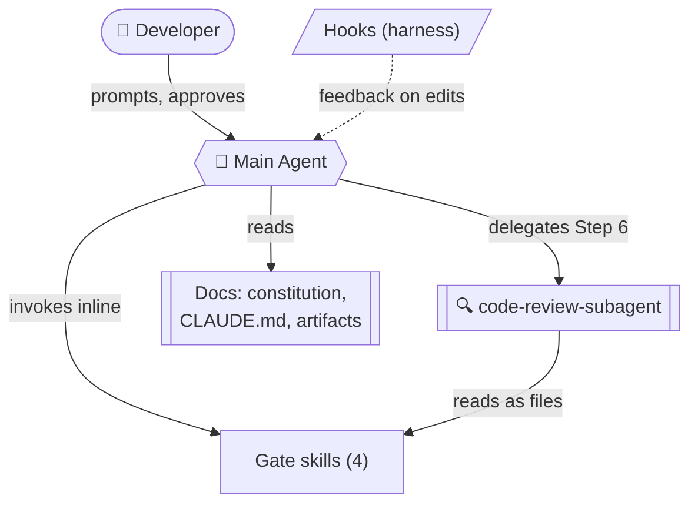

# Project Architecture — Components & Relations

How the moving parts of this project relate: the **main agent**, the four **gate
skills** (the five gates minus Performance, which has no skill and is reviewed manually),
the **code-review subagent**, and the **hooks**. For *what* each rule means see
[`CLAUDE.md`](../CLAUDE.md); for the *principles* behind them see
[`.specify/memory/constitution.md`](../.specify/memory/constitution.md). This document is
the *map* — it shows when each component fires, who calls it, and who it talks to.

> Legend: ✅ exists today · *(proposed)* = a slot to add later.

## 1. The big picture



*Arrows show who calls whom; the sections below add the detail.*

## 2. The same components, mapped onto the workflow

Where each component actually *fires*, top to bottom. `*` = proposed hook.

```
SESSION START ──▶ [SessionStart hook*] loads constitution into Main Agent
                        │
DEVELOPER ─prompts─▶ MAIN AGENT
                        │
 Step 1 Requirements ─▶ invoke security-skill ───────────────▶ findings
 Step 2 Specification ▶ invoke security-skill ───────────────▶ findings
 Step 3 Plan ─────────▶ invoke security + architecture +
                        testing(Mode 1) skills; perf reviewed
                        manually (no skill) ─────────────────▶ findings
                        │
                        └─▶ ⛔ APPROVAL GATE: developer must say go
                        │
 Step 4 Tasks ────────▶ invoke ALL 5 gates (+ testing Mode 2) ▶ findings
                        │
 Step 5 Implementation (loop per task, TDD):
        ├─ testing-skill Mode 3: write tests, watch them fail
        ├─ ✍️  Edit/Write test file ─▶ [run-tests.sh] RED  ─feedback─▶ agent
        ├─ implement + logs + docs (logging-docs-skill inline)
        ├─ ✍️  Edit/Write src file  ─▶ [PreToolUse TDD guard*] allow/block
        │                             [run-tests.sh] GREEN ─feedback─▶ agent
        │                             [format/lint*], [sec-scan] ─feedback─▶ agent
        └─ (security/perf/arch applied inline as relevant)
                        │
 Step 6 After impl ───▶ delegate to code-review-subagent
                        (reads the 4 SKILL.md files, audits whole
                        diff against all 5 gates incl. manual perf)
                        └─▶ verdict + findings ─▶ agent resolves
                        │
                        └─▶ ⛔ DEVELOPER gives final acceptance
```

## 3. Component reference

| Component | When it's used | Who calls it | What it talks to | Role |
|---|---|---|---|---|
| **Main Agent** | Throughout, every phase | The **developer** (prompts) | Reads constitution/CLAUDE.md/artifacts; invokes skills; delegates to subagent; receives hook feedback | Senior Python Engineer. Owns the workflow, writes code & tests, runs gates inline, but **never self-approves**. |
| **testing-skill** ✅ | 4 points: plan done (Mode 1), tasks done (Mode 2), before each task (Mode 3), all tasks done (Mode 4) | Main agent via **Skill tool** (also user-invocable `/testing-skill`); **read as a file** by the subagent | Reads `plan.md`/`tasks.md`/tests; returns PASS / CHANGES NEEDED / GAPS | Enforces TDD & test quality (Principle III). Owns *judgment*; the hook owns *execution*. |
| **security-skill** ✅ | Steps 1, 2, 3, 4, and inline in 5 | Main agent (Skill tool); read as file by subagent | Reads artifacts + code | Security gate (Principle V): trust boundaries, input validation, secrets, OWASP. |
| **Performance gate** *(no skill — manual)* | Steps 3, 4, inline in 5 | Main agent (manual review); subagent reviews manually too | Plan + code | Performance gate by design has **no skill**: bottlenecks, expensive ops, large data, caching — reviewed manually against the constitution checklist. |
| **logging-docs-skill** ✅ | Step 4, and **inline during impl** (Step 5.4) | Main agent (Skill tool); read as file by subagent | Reads code + docs | Logging **and** documentation gate (no separate docs gate): docstrings + diagnosable, non-sensitive, concise logs. |
| **architecture-skill** ✅ | Steps 3, 4, inline in 5 | Main agent (Skill tool); read as file by subagent | Reads plan + code | Architecture + formatting gate (Principle IV): plan alignment, simplicity, separation of concerns, no needless abstraction. |
| **code-review-subagent** ✅ | **Step 6 only** — once, after implementation | Main agent **delegates** (Agent/Task tool) into isolated context | **Reads** the 4 `SKILL.md` files (it has no Skill tool) and reviews performance manually, reads the merge-base diff + artifacts; returns verdict | Independent fresh-eyes audit of the *whole change* against all 5 gates at once. Read-only, advisory, **never approves**. |
| **run-tests.sh hook** ✅ | Automatically after **every** Edit/Write/MultiEdit on `src/**.py` or `tests/**.py` | The **harness** (PostToolUse event) — not the agent, not a skill | Reads tool-input JSON; runs `uv run pytest`; on failure exits 2 to feed output back to main agent | Continuous red/green execution feedback for the TDD loop. Silent until project has `pyproject.toml` + tests. |
| **security-scan.sh hook** ✅ | Automatically after **every** Edit/Write/MultiEdit on `src/**.py` or `tests/**.py` | The **harness** (PostToolUse event) | Reads tool-input JSON; conservative hardcoded-secret scan + `bandit` (medium+); on a finding exits 2, **value redacted** | Mechanical half of the Security gate; **complements** `security-skill` (which owns the OWASP judgment). Silent until project has `pyproject.toml`. |

## 4. Hooks that pair a deterministic check with a judgment skill

The **security scan is now built** (`.claude/hooks/security-scan.sh`, see §3). Format+lint is still
a proposed slot.

| Hook | Status | Event | Backs which skill | Why a hook, not just the skill |
|---|---|---|---|---|
| **format + lint** (`ruff`/`black`) | *(proposed)* | PostToolUse Edit/Write on `*.py` | architecture+formatting **and** logging-docs (enable ruff `D` = missing docstring, `T20` = stray `print()`) | Formatting/style is mechanical; run it on every edit, not at review time. No separate logging-docs **or** architecture hook — both skills' mechanical checks ride here; the skills own the judgment. |
| **security scan** (`bandit` + secrets-detect) | ✅ built | PostToolUse Edit/Write on `src`/`tests` `*.py` | security-skill | Catches hardcoded secrets / obvious sinks the moment they're written. |

## 5. Three relationship patterns worth remembering

1. **Skills are invoked inline; the subagent is delegated.** The main agent *calls
   skills via the Skill tool* during Steps 1–5 and stays in its own context. The subagent
   runs in an **isolated context** (Step 6) — that isolation is the point: a fresh-eyes
   reviewer that can't be biased by the implementation reasoning.

2. **The subagent consumes skills as files, not as tools.** It has only `Read, Grep,
   Glob, Bash` — no Skill tool — so it `Read`s each available `SKILL.md` to reuse the *same
   checklists* the main agent used (Performance has no skill, so it reviews that gate manually
   against the constitution). One source of truth, two consumption modes.

3. **Hooks are pushed by the harness, not pulled by anyone.** No skill or agent ever
   "calls" a hook; they fire on tool/session events and feed text back to the main agent.
   So: **skills/subagent = judgment** (PASS/CHANGES NEEDED), **hooks = execution &
   enforcement** (tests run, formatter runs, writes blocked).

Underneath all of it: **only the developer approves.** Every skill and the subagent are
advisory — they surface findings, the main agent resolves them, but the plan→implementation
crossing and final acceptance are the developer's alone.
